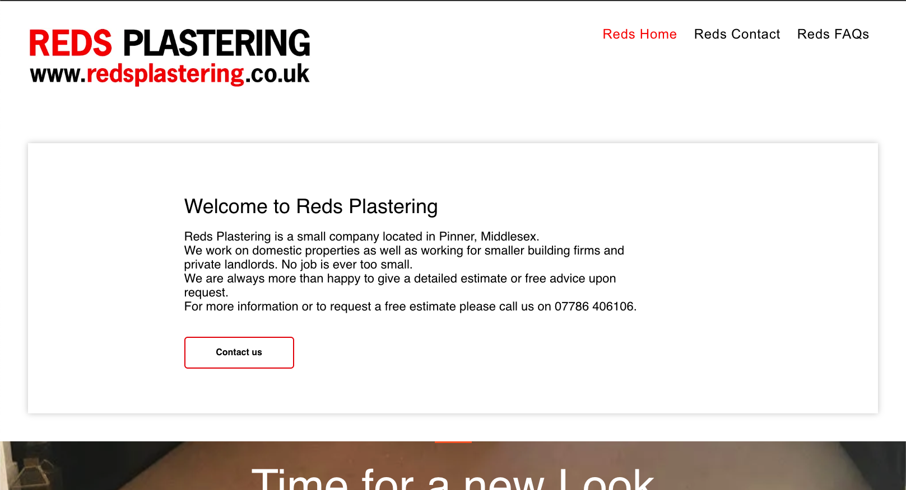
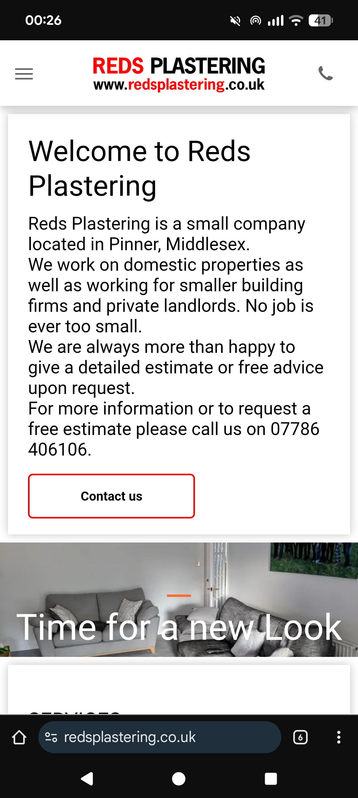
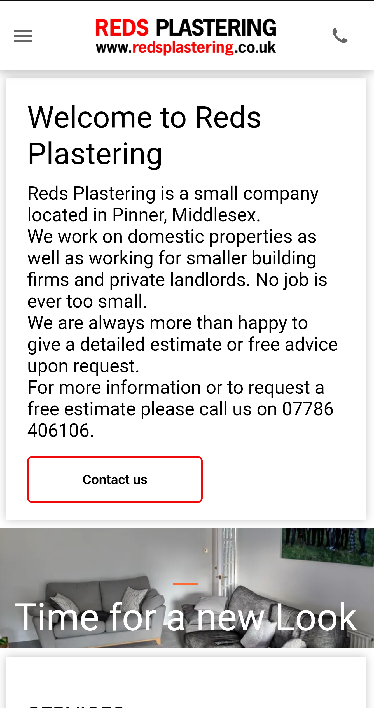

1976uk-creative Website - 4th November 2025

Websites page
Add the reds thumbnail
Add the desktop and mobile images because the live preview will not work with Ionos
 - Use for websites page thumbnail and live preview fake desktop 
 - Use for live preview fake mobile site

- Looking good now but the dashboard / mobile toggle is only showing desktop. Can we amke the toggle work using - 

Dashboard Simple
Add edit function - Edits the Title
Add preview function - Shows the image in a Lightbox

Dashboard Pro
Add edit function - Opens Lightbox with image editing tools: Brightness, Saturation, Colour
Add preview function - Opens Lightbox with before/after and crop image 

Later on if time allows..

Can we make the 'creative' under the '1967uk' title appear on Google chrome browser the same as it does on 

Contact page
Add contact email if it makes any difference
WP SMTP mail is a premium service

Oh my, this is something very spacial. Ive beed going through the sliders are very good and i think i need to change some of the images to get the most out of them. But cant wait to see the finished concept. You have got the style the space and its so current and fresh, I had to have a day in awe of managing to get all these functions, that are the same as the settings in Photoshop etc, work so well the way they do, and the blur is ACE!. Can we fix the logout button on the pro dashboard so it goes back to the Gallery page and remove the link buttons to the Simple dashboard please? There is a big purple one at the bottom of the Gallery panels and there is the floating purple Dashboard Simple button - both to be removed or commented out. 

As much as i love the colours on the Websites and Gallery pages and the animated gradient is sublime but if you could work your magic and create that low key future teched ice cold stone look with colour but the lines running though the backgroud like the contact page and then update the Websites and Gallery and Dashboard pages bsckgrounds i would be very grateful. Sorry if thats a bit unexpexcted as i am just trying to get notes together and catch up

Also i was wondering if we could make more use of the screen in all our pages. Is there a way we can change the layout at all? I really like how we have 3 cards wide in th gallery this 40px padding between the edge of the cards and the div.dashboard-section on the gallery page. It leads really well to the lightbox for the Gallery page and how i would like the styling of the lightbox as it will be similar to the Dragica site with the 96 . Do you think we can change the layout first? or do we carry on with some more dashboard?